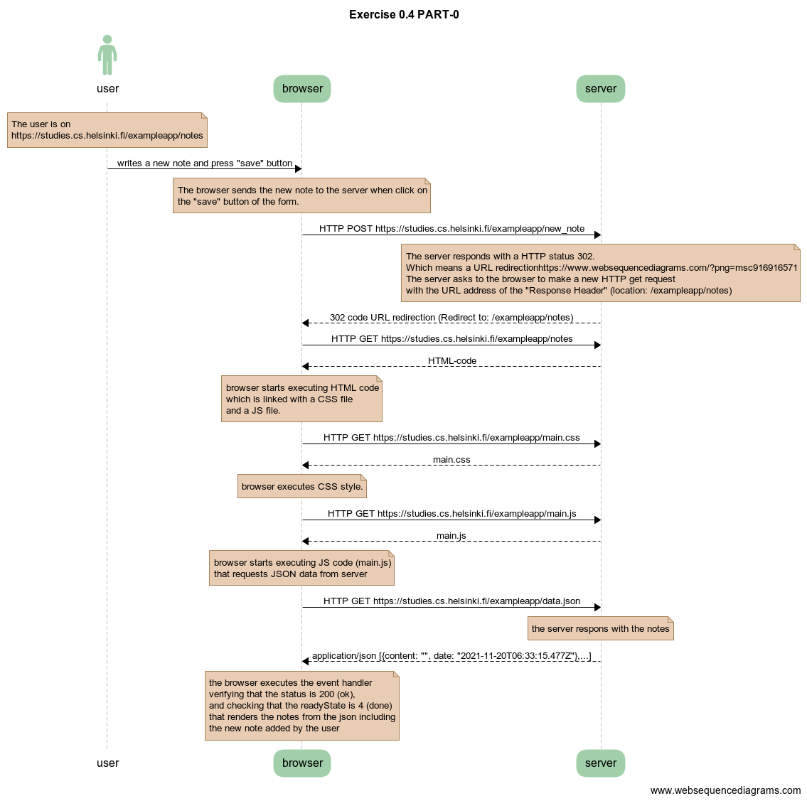
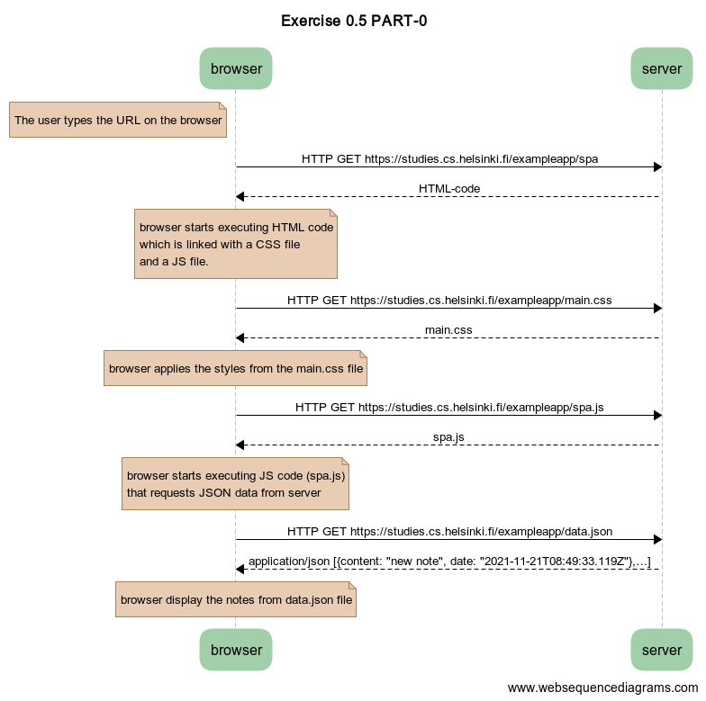
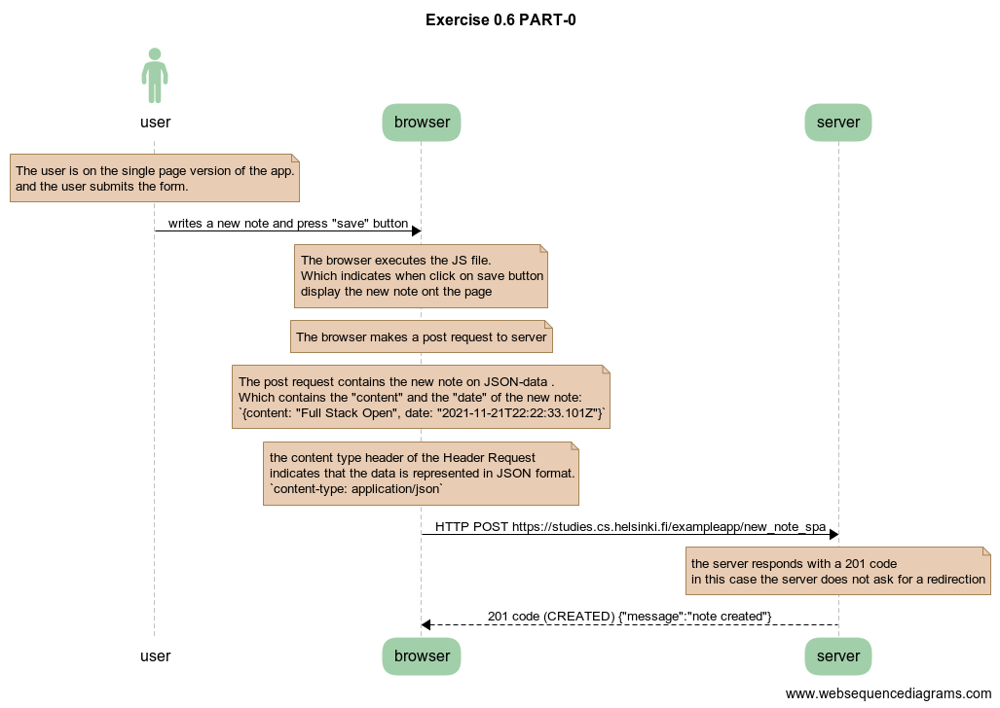

# Part 0 - Fundamental of Web apps
*By Miguel Parra*

## Exercise 0.4: new note



``` 
title Exercise 0.4 PART-0

actor user

note over user 
The user is on 
https://studies.cs.helsinki.fi/exampleapp/notes
end note

user->browser: writes a new note and press "save" button

note over browser:
The browser sends the new note to the server when click on
the "save" button of the form.
end note

browser->server: HTTP POST https://studies.cs.helsinki.fi/exampleapp/new_note
note over server:
The server responds with a HTTP status 302.
Which means a URL redirection
The server asks to the browser to make a new HTTP get request
with the URL address of the "Response Header" (location: /exampleapp/notes)
end note
server-->browser: 302 code URL redirection (Redirect to: /exampleapp/notes)
browser->server: HTTP GET https://studies.cs.helsinki.fi/exampleapp/notes
server-->browser: HTML-code

note over browser:
browser starts executing HTML code
which is linked with a CSS file
and a JS file.
end note

browser->server: HTTP GET https://studies.cs.helsinki.fi/exampleapp/main.css
server-->browser: main.css

note over browser:
browser executes CSS style.
end note


browser->server: HTTP GET https://studies.cs.helsinki.fi/exampleapp/main.js
server-->browser: main.js

note over browser:
browser starts executing JS code (main.js)
that requests JSON data from server
end note

browser->server: HTTP GET https://studies.cs.helsinki.fi/exampleapp/data.json

note over server:
the server respons with the notes
end note

server-->browser: application/json [{content: "", date: "2021-11-20T06:33:15.477Z"},...]

note over browser:
the browser executes the event handler
verifying that the status is 200 (ok), 
and checking that the readyState is 4 (done)
that renders the notes from the json including
the new note added by the user
end note
```

## Exercise 0.5: Single page app



```
title Exercise 0.5 PART-0

note left of browser 
The user types the URL on the browser
end note

browser->server: HTTP GET https://studies.cs.helsinki.fi/exampleapp/spa
server-->browser: HTML-code

note over browser:
browser starts executing HTML code
which is linked with a CSS file
and a JS file.
end note


browser->server: HTTP GET https://studies.cs.helsinki.fi/exampleapp/main.css
server-->browser: main.css

note over browser:
browser applies the styles from the main.css file
end note

browser->server: HTTP GET https://studies.cs.helsinki.fi/exampleapp/spa.js
server-->browser: spa.js

note over browser:
browser starts executing JS code (spa.js)
that requests JSON data from server
end note

browser->server: HTTP GET https://studies.cs.helsinki.fi/exampleapp/data.json
server-->browser: application/json [{content: "new note", date: "2021-11-21T08:49:33.119Z"},…]

note over browser:
browser display the notes from data.json file
end note

```

### Exercise 0.6: New note



```
title Exercise 0.6 PART-0

actor user

note over user 
The user is on the single page version of the app.
and the user submits the form.
end note

user -> browser: writes a new note and press "save" button

note over browser
The browser executes the JS file.
Which indicates when click on save button
display the new note ont the page
end note

note over browser
The browser makes a post request to server
end note

note over browser
The post request contains the new note on JSON-data .
Which contains the "content" and the "date" of the new note:
`{content: "Full Stack Open", date: "2021-11-21T22:22:33.101Z"}`
end note

note over browser
the content type header of the Header Request
indicates that the data is represented in JSON format.
`content-type: application/json`
end note

browser->server: HTTP POST https://studies.cs.helsinki.fi/exampleapp/new_note_spa

note over server
the server responds with a 201 code
in this case the server does not ask for a redirection
end note
server-->browser: 201 code (CREATED) {"message":"note created"}


```